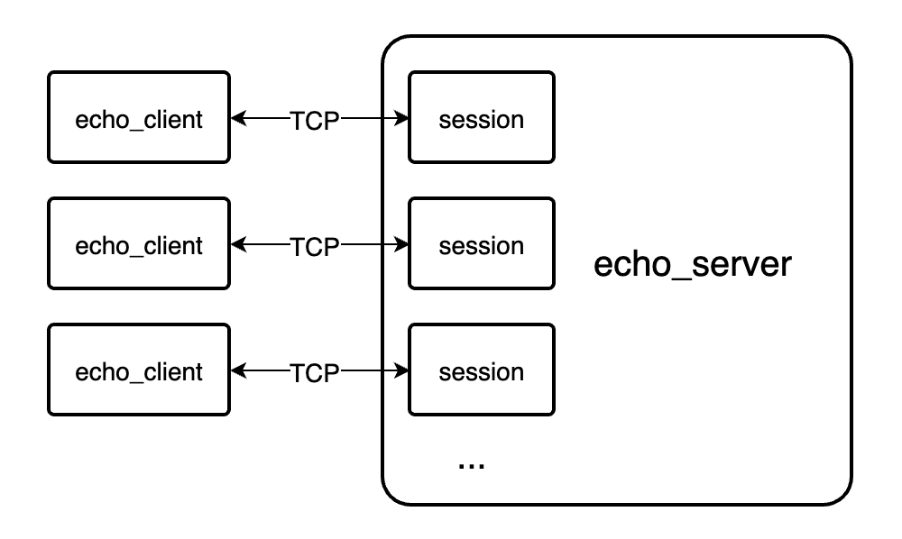

## 太长不看版

- 无栈协程的性能比有栈协程强大约1~2个数量级

- 但是，用到协程的场合（比如后台服务），一般来说性能瓶颈是IO，协程的消耗可以忽略不计。这种情况下，更应该关注协程库的易用性和健壮性

- 很多有栈协程库并没有正确处理stack unwind，在使用这些库时必须保证协程函数体优雅退出，否则可能会引起资源泄露，严重时会导致crash

- 有栈协程库的共享栈并不是一个很好的方案，需要注意局部变量的使用，严重时会导致crash

- 直接看[总结](#5-总结)

## 1. 序

### 1.1. 简介

本文的主要内容是对C++几个协程库的基础协程功能进行易用性、健壮性和性能上的对比。这里的基础协程功能是指协程的创建、切换和销毁等，而不包括协程的调度、管理、同步或任何业务相关的功能。引用flare协程库文档里的说明<!--[一段话](https://git.woa.com/ads/flare/blob/master/flare/doc/fiber.md)-->：


是一种轻量的线程，也常被称为“纤程”、“绿色线程”等。其作为一个调度实体接收运行时的调度。
为方便使用，我们也提供了用于fiber的Mutex、ConditionVariable、this_fiber::、fiber局部存储等基础设施以供使用。

使用fiber编程时思想与使用pthread编程相同，均是使用传统的普通函数（这与下文中的coroutine形成对比）编写同步代码，并由运行时/操作系统负责在fiber/pthread阻塞时进行调度。



是一种可以被挂起、恢复（多进多出）的函数（“subroutine”）。其本身是一种被泛化了的函数。
由于协程本质上依然是一个函数，因此其不涉及调度、锁、条件变量、局部存储等问题。


所以本文的讨论只涉及后者

本文研究的协程库如下：

- 【无栈】[Boost.Asio无栈协程](https://www.boost.org/doc/libs/1_77_0/doc/html/boost_asio/overview/core/coroutine.html)：通过3个宏实现了类似协程的语义，本质上是一个用[Duff's device](https://en.wikipedia.org/wiki/Duff%27s_device)实现的switch语句。它是一个只有300多行的头文件（注释占了200多行）

- 【无栈】[C++20协程](https://en.cppreference.com/w/cpp/language/coroutines)：C++20标准定义的协程，协程函数体的写法与有栈协程类似，编译器通过分析协程函数体，将协程状态和局部变量放到一块堆分配的内存上，从而转成无栈的形式。它具有极高的性能，还提供了很多concept可以自定义协程的行为，非常灵活

- 【无栈】[cppcoro](https://github.com/lewissbaker/cppcoro)：目前C++20协程只定义了框架，相关的库函数极少，cppcoro正是这些缺失的库函数。cppcoro定义了task、generator、when_all等开箱即用的高级抽象

- 【有栈】[Boost.Context](https://www.boost.org/doc/libs/1_77_0/libs/context/doc/html/index.html)：C++有栈协程库的中流砥柱，偏底层，支持ARM、MIPS、PowerPC、RISC-V、S390x、X86等平台，有着优秀的性能和稳定性。大量的有栈协程库只是对Boost.Context的封装

- 【有栈】[libco](https://github.com/Tencent/libco)：微信开发的协程库，共享栈和hook sys call是其两大特色。本文使用的是github开源版，据说微信内部使用的版本已完全不同于开源版本

- 【无栈+有栈】[libcopp](https://github.com/owent/libcopp)：从名字上可以看出作者的目标：libco的“pp版”。提供了多种协程的实现，本文涉及的是其中两个组件：

  - coroutine_context：基于Boost.Context的有栈协程，提供了更符合直觉的接口

  - future：参考rust语言协程模型设计的无栈协程，用于平滑接入C++20协程，直接使用会比较繁琐。由于篇幅限制，本文没有详细讨论，但加入到了benchmark里

其中使用的版本是：

|         | 版本                                                     | 最后更新日期 | 备注                                       |
| ------- | -------------------------------------------------------- | ------------ | ------------------------------------------ |
| Boost   | 1.77.0                                                   | 2021/08/11   |                                            |
| cppcoro | master latest (a87e97fe5b6091ca9f6de4637736b8e0d8b109cf) | 2020/07/06   |                                            |
| libco   | master latest (dc6aafcc5e643d3b454a58acdc78e223634bbd1e) | 2020/10/27   |                                            |
| libcopp | 1.4.1                                                    | 2021/06/13   | 编译选项：-DLIBCOPP_DISABLE_ATOMIC_LOCK=ON |


本文没有讨论，但笔者有过了解的协程库有：

- 【无栈】[Boost.Asio awaitable](https://www.boost.org/doc/libs/1_77_0/doc/html/boost_asio/overview/core/cpp20_coroutines.html)：Boost.Asio对C++20协程的封装，与Boost.Asio框架绑定，无缝配合。为方便起见，本文的echo_client示例使用了Boost.Asio awaitable

- 【无栈】[libunifex](https://github.com/facebookexperimental/libunifex)：facebook主导开发的sender/receiver异步模型，是C++23 Executors提案的一个变种。协程只是里面的一个很小的部分，实现了sender/receiver模型与C++20协程的适配。cppcoro的作者参与了开发，可以理解为是cppcoro的强化版

- 【有栈】[Boost.Coroutine2](https://www.boost.org/doc/libs/1_77_0/libs/coroutine2/doc/html/index.html)：基于Boost.Context的一个非对称协程的实现，现时来看没有太大特色

- 【有栈】[Boost.Fiber](https://www.boost.org/doc/libs/1_77_0/libs/fiber/doc/html/index.html)：基于Boost.Context实现的协程调度、管理、同步等功能，属于上面所说的“纤程”库。实现了多种高级抽象，如：mutex、condition variable、barrier、channel、future、fiber local storage，还有NUMA架构优化和GPU计算

- 【有栈】flare<!--[flare](https://git.woa.com/ads/flare)-->：腾讯AMS广告营销服务线开发的公共组件，是腾讯TRPC里使用的协程库，协程方面的功能与Boost.Fiber类似，在性能和业务开发上有更多的思考。底层使用的也是Boost.Context

<!--
- 【有栈】JLib：来自腾讯天美J1/F1工作室，具有很久的历史，使用共享栈，与业务强相关
-->

### 1.2. 示例说明：echo_server

我们将设计一个echo_server示例以展示各个协程库的简单使用方法，如下图所示：



当echo_server接收到的一个新的连接时，将会创建一个session进行管理以及收发数据。本文将用不同的协程库来实现session，其中session的接口如下所示：

```cpp
struct buffer {
  std::size_t size_;
  char* data_;

  buffer() {
    LOG("buffer create"); // magic log
    data_ = new char[4096];
  }
  ~buffer() {
    LOG("buffer destroy"); // magic log
    delete[] data_;
  }
};

struct session {
  session_context* sc_; // session的上下文数据，阅读本文无需关注

  session() { LOG("session create"); }
  virtual ~session() { LOG("session destroy"); }

  virtual void resume() = 0;          // 继续协程的执行
  void start_async_recv(buffer& buf); // 异步接收数据放进buf里，完成后调用resume
  void start_async_send(buffer& buf); // 异步发送buf里的数据，完成后调用resume
};
```

## 2. 无栈协程

### 2.1. 基于switch语句的协程
```cpp
struct simple_stackless_coroutine_session : session {
  buffer buf_; // 必须放这里
  unsigned char state_ = 0;

  void resume() {
    // buffer buf_; // 不能放这里，否则每次调用resume都会构造和销毁buf_
    switch (state_) {
    case 0:
      state_ = 1;
      start_async_recv(buf_);
      break;
    case 1:
      state_ = 0;
      start_async_send(buf_);
      break;
    }
  }
};
```

PROS：

- 没有（没有库的依赖可能可以算一个优势）

CONS：

- 不能在协程函数体里定义跨越两次resume的局部变量

- 很原始，繁琐，非常难用

### 2.2. Boost.Asio无栈协程
```cpp
struct asio_stackless_coroutine_session : session {
  buffer buf_;
  boost::asio::coroutine co_; // 协程state，里面只有一个int

  void resume() {
    reenter(co_) for (;;) {
      yield start_async_recv(buf_);
      yield start_async_send(buf_);
    }
  }
};
```
resume()函数宏展开后：
```cpp
void resume() {
  switch (::boost::asio::detail::coroutine_ref _coro_value = co_)
  case -1:
    if (_coro_value) {
      goto terminate_coroutine;
    terminate_coroutine:
      _coro_value = -1;
      goto bail_out_of_coroutine;
    bail_out_of_coroutine:
      break;
    } else
    case 0:
      for (;;) {
        for (_coro_value = (5);;)
          if (_coro_value == 0) {
          case (5):;
            break;
          } else
            switch (_coro_value ? 0 : 1)
              for (;;)
              case -1:
                if (_coro_value)
                  goto terminate_coroutine;
                else
                  for (;;)
                  case 1:
                    if (_coro_value)
                      goto bail_out_of_coroutine;
                    else
                    case 0:
                      start_async_recv(buf_);
        for (_coro_value = (6);;)
          if (_coro_value == 0) {
          case (6):;
            break;
          } else
            switch (_coro_value ? 0 : 1)
              for (;;)
              case -1:
                if (_coro_value)
                  goto terminate_coroutine;
                else
                  for (;;)
                  case 1:
                    if (_coro_value)
                      goto bail_out_of_coroutine;
                    else
                    case 0:
                      start_async_send(buf_);
      }
}
```
PROS：

- 写法上有协程那味了，而且对比上一个方案，几乎没有性能开销

- 依赖只有一个头文件

CONS：

- 同样地，不能在协程函数体里定义跨越两次resume的局部变量

- 由于本质上是一堆switch和for语句，需要非常注意临时局部变量和break的使用

### 2.3. C++20协程
```cpp
struct cpp20_coroutine_session : session {
  // C++20协程要求的定义，阅读本文无需过度关注
  struct task {
    struct promise_type {
      suspend_always initial_suspend() noexcept { return {}; }
      suspend_always final_suspend() noexcept { return {}; }
      task get_return_object() {
        return coroutine_handle<promise_type>::from_promise(*this);
      }
      void return_void() {}
      void unhandled_exception() { std::terminate(); }
    };

    coroutine_handle<promise_type> handle_;

    task(coroutine_handle<promise_type> handle) : handle_(handle) {}
    task(task&& r) : handle_(std::exchange(r.handle_, nullptr)) {}
    ~task() {
      if (handle_)
        handle_.destroy();
    }
  };

  task task_;

  cpp20_coroutine_session() : task_(coroutine_body()) {}

  void resume() { task_.handle_.resume(); }

  // 协程函数体，主要关注点
  task coroutine_body() {
    buffer buf; // buf可以放这里了！
    for (;;) {
      start_async_recv(buf);
      co_await suspend_always();
      start_async_send(buf);
      co_await suspend_always();
    }
  }
};
```

C++20协程是无栈协程，为什么buf可以放在协程函数体里呢？带着这个疑问，我们来查看协程函数体被编译后的汇编代码：

```nasm
;;; 创建协程状态
cpp20_coroutine_session::coroutine_body():
        push    r14
        push    rbx
        push    rax
        mov     r14, rsi                       ;; rsi是cpp20_coroutine_session的指针
        mov     rbx, rdi                       ;; rdi是task_的指针
        mov     edi, 48
        call    operator new(unsigned long)    ;; 从堆分配48字节内存
                                               ;; offset 0保存resume函数指针
        mov     qword ptr [rax], offset cpp20_coroutine_session::coroutine_body() [clone .resume]
                                               ;; offset 8保存destroy函数指针
        mov     qword ptr [rax + 8], offset cpp20_coroutine_session::coroutine_body() [clone .destroy]
        mov     qword ptr [rax + 40], r14      ;; offset 40保存cpp20_coroutine_session的指针
        mov     qword ptr [rbx], rax           ;; 将这48字节内存的指针赋值到task_的位置
        mov     byte ptr [rax + 17], 0         ;; offset 17指向的1个byte设置为0，这是协程state
                                               ;; 注意offset 24~40未初始化，用来存放buf
        mov     rax, rbx
        add     rsp, 8
        pop     rbx
        pop     r14
        ret

;;; 协程resume
cpp20_coroutine_session::coroutine_body() [clone .resume]:
        push    r14
        push    rbx
        push    rax
        mov     rbx, rdi
        lea     r14, [rdi + 24]
        mov     al, byte ptr [rdi + 17]
        cmp     al, 2
        je      .LBB10_3                       ;; if (state == 2) goto .LBB10_3
        cmp     al, 1
        jne     .LBB10_2                       ;; if (state != 1) goto .LBB10_2
        mov     byte ptr [rbx + 17], 2         ;; state = 2
        mov     rdi, qword ptr [rbx + 40]
        mov     rsi, r14
        call    session::start_async_send(buffer&)
        jmp     .LBB10_10
.LBB10_2:
        mov     rdi, r14
        call    buffer::buffer() [base object constructor]
.LBB10_3:
        mov     byte ptr [rbx + 17], 1         ;; state = 1
        mov     rdi, qword ptr [rbx + 40]
        mov     rsi, r14
        call    session::start_async_recv(buffer&)
.LBB10_10:
        add     rsp, 8
        pop     rbx
        pop     r14
        ret

;;; 销毁协程状态
cpp20_coroutine_session::coroutine_body() [clone .destroy]:
        push    rbx
        mov     rbx, rdi
        cmp     byte ptr [rdi + 17], 0
        je      .LBB11_2                       ;; if (state == 0) goto .LBB11_2
        lea     rdi, [rbx + 24]
        call    buffer::~buffer() [base object destructor]
.LBB11_2:
        mov     rdi, rbx
        pop     rbx
        jmp     operator delete(void*)  # TAILCALL
```

将汇编语言翻译过来，相当于：

```cpp
struct coroutine_body {
  void (*resume_func_)(coroutine_body*);
  void (*destroy_func_)(coroutine_body*);
  unsigned char unused_;
  unsigned char state_;
  char buf_storage_[sizeof(buffer)]; // 协程函数体里的局部变量buf占用的空间
  cpp20_coroutine_session* session_;

  buffer& buf() { return *reinterpret_cast<buffer*>(buf_storage_); }

  static coroutine_body* create(cpp20_coroutine_session::task* t,
                                cpp20_coroutine_session* session) {
    coroutine_body* co = new coroutine_body;
    co->resume_func_ = &resume;
    co->destroy_func_ = &destroy;
    co->session_ = session;
    *reinterpret_cast<coroutine_body**>(&t->handle_) = co;
    co->state_ = 0;
    return co;
  }

  static void resume(coroutine_body* co) {
    switch (co->state_) {
    case 1:
      co->state_ = 2;
      co->session_->start_async_send(co->buf());
      break;
    default:
      new (&co->buf()) buffer; // placement new，调用buf的构造函数
    case 2:
      co->state_ = 1;
      co->session_->start_async_recv(co->buf());
      break;
    }
  }

  static void destroy(coroutine_body* co) {
    if (co->state_ != 0)
      co->buf().~buffer(); // 调用buf的析构函数
    delete co;
  }
};

static_assert(sizeof(coroutine_body) == 48);
```

如果将这个翻译后的代码再编译成汇编语言，相似度有95%

可以很清楚地看到，C++20协程被编译后，代码运行逻辑与switch语句类似，本质上仍是无栈协程

PROS:

- 用法上像有栈协程，却拥有无栈协程的性能，属于一种编译器帮你实现的高级语法糖

- 有很多concept可以自定义协程的行为

CONS:

- 需要C++20标准的支持

- 必须明确使用几个关键字来yield（这是为了让编译器做分析），无法做到业务无侵入

### 2.4. cppcoro

```cpp
struct cppcoro_task_session : session {
  cppcoro::task<> task_; // 不用写一大堆定义，开箱就用

  cppcoro_task_session() : task_(coroutine_body()) {}

  void resume() {
    // cppcoro::task没有提供resume接口，这是一个hack
    reinterpret_cast<coroutine_handle<>*>(&task_)->resume();
  }

  cppcoro::task<> coroutine_body() {
    buffer buf;
    for (;;) {
      start_async_recv(buf);
      co_await suspend_always();
      start_async_send(buf);
      co_await suspend_always();
    }
  }
};
```

PROS:

- 所有C++20协程的优势，而且自带很多开箱即用的功能

- task类已经自带了[symmetric transfer](https://lewissbaker.github.io/2020/05/11/understanding_symmetric_transfer)的实现

CONS:

- task类正常情况下无法手动resume，需要一些hack

- 作者的工作中心可能已经在libunifex上了，cppcoro已有一段时间没维护

## 3. 有栈协程

### 3.1. Boost.Context

Boost.Context有三种实现：fcontext_t、posix ucontext_t、WinFiber，通过编译选项来控制，它们的差别请参见[这里](https://www.boost.org/doc/libs/1_77_0/libs/context/doc/html/context/ff/implementations__fcontext_t__ucontext_t_and_winfiber.html)。本文用的是性能最好的fcontext_t

fcontext_t主要针对各支持的平台，用汇编语言实现了以下三个接口：

- make_fcontext：协程创建

- jump_fcontext：协程上下文切换

- ontop_fcontext：先进入协程的上下文，再调用一个自定义函数（后面还会讨论）

一般使用的是封装好的类boost::context::fiber

```cpp
struct boost_context_fiber_session : session {
  using fiber = boost::context::fiber;

  fiber fiber_;
  fiber* sink_;

  boost_context_fiber_session()
      : fiber_(std::allocator_arg, boost::context::fixedsize_stack(STACK_SIZE),
               [&](fiber&& sink) { return coroutine_body(sink); }) {}

  void resume() { fiber_ = std::move(fiber_).resume(); }
  void yield() { *sink_ = std::move(*sink_).resume(); }

  fiber coroutine_body(fiber& sink) {
    sink_ = &sink;

    buffer buf;
    for (;;) {
      start_async_recv(buf);
      yield();
      start_async_send(buf);
      yield();
    }
    return std::move(sink);
  }
};
```

PROS：

- 支持多平台

- 优秀的性能和稳定性

CONS：

- 接口不太直观

- 需要大量用到移动语义（boost::context::fiber是move only的）

### 3.2. libcopp coroutine_context

libcopp coroutine_context底层使用了Boost.Context fcontext_t里的其中两个接口make_fcontext和jump_fcontext，并封装了一些人性化的接口

```cpp
struct libcopp_coroutine_context_session : session {
  copp::coroutine_context_default::ptr_t co_;

  libcopp_coroutine_context_session()
      : co_(copp::coroutine_context_default::create(
            [&](void*) { return coroutine_body(), 0; }, STACK_SIZE)) {}

  void resume() { co_->resume(); }

  void coroutine_body() {
    buffer buf;
    for (;;) {
      start_async_recv(buf);
      co_->yield();
      start_async_send(buf);
      co_->yield();
    }
  }
};
```

PROS：

- 符合直觉的接口

- Boost.Context带来的优势 (?)

### 3.3. libco

```cpp
struct libco_session : session {
  static void* coroutine_entry(void* arg) {
    static_cast<libco_session*>(arg)->coroutine_body();
    return nullptr;
  };

  stCoRoutine_t* co_;

  libco_session() {
    stCoRoutineAttr_t attr;
    attr.stack_size = STACK_SIZE;
    attr.share_stack = nullptr; // 要使用共享栈，只需改一下这里
    co_create(&co_, &attr, coroutine_entry, this);
  }

  ~libco_session() { co_release(co_); }

  void resume() { co_resume(co_); }

  void coroutine_body() {
    buffer buf;
    for (;;) {
      start_async_recv(buf);
      co_yield_(co_);
      start_async_send(buf);
      co_yield_(co_);
    }
  }
};
```

PROS：

- 简单而直观的接口

- 支持共享栈 (?)

- 有hook sys call，可以将一些系统调用改成兼容协程的形式，这“可能”对某些用户很有用

- 微信的光环

### 3.4. stack unwind问题

运行echo_server，用echo_client向其建立1个连接发送任意数据随后关闭连接，查看echo_server的日志

用libcopp coroutine_context和libco实现的session的日志：
```
session create
buffer create
session destroy
```

其他实现的session的日志：
```
session create
buffer create
buffer destroy
session destroy
```

也就是说，用libcopp coroutine_context和libco实现的session，buf的析构函数没有被调用

需要说明的是，本文实现的echo_server，当客户端关闭连接时，echo_server不会调用session的resume，而是直接delete session。相当于协程正在挂起状态时，强制被销毁了，而这正是问题的所在

在这种情况下，libcopp coroutine_context和libco没有做正确的stack unwind，虽然分配的栈被回收了，但是仍然活跃的局部变量的析构函数没有被调用

这在C语言里没有问题，因为C语言没有析构函数，如果你的程序是用C语言写的，那么可以放心使用他们

但在C++里是个大问题，有一个解决办法是：在销毁协程前，必须保证协程优雅退出，这样所有局部变量的析构函数都会得到正确的调用

但是更奇怪的一点是，同样是有栈协程的Boost.Context，为什么没问题呢？让我们来看一下boost::context::fiber的析构函数做了什么：

```cpp
namespace detail {
transfer_t fiber_unwind(transfer_t t) {
  throw forced_unwind(t.fctx);
  return { nullptr, nullptr };
}
}

fiber::~fiber() {
  if (nullptr != fctx_) // fctx_ == nullptr的话，表示协程已经运行完结（但还没销毁）
    detail::ontop_fcontext(std::exchange(fctx_, nullptr), nullptr, detail::fiber_unwind);
}
```

回顾一下ontop_fcontext的作用：先进入协程的上下文，再调用一个自定义函数

也就是说，它判断如果协程还没完结，则先进入这个被挂起的协程的上下文，然后抛了一个forced_unwind异常。我们无需关心这个异常怎么被处理，因为最关键的是，C++异常机制会保证正确的stack unwind，所以Boost.Context不会出现这个问题

libcopp coroutine_context只使用了Boost.Context的make_fcontext和jump_fcontext这两个接口，所以协程被强制销毁时没有正确的stack unwind

### 3.5. 共享栈问题

echo_server的逻辑非常简单，只是将接收到的数据原样返回，理论上echo_client发送和收到的数据是一样的，但我们还是加了一个检查

运行echo_client不间断地向echo_server发送数据，用libco共享栈实现的session会出现收发数据不一致、卡死或crash的情况。而其他实现的session则不会有问题

这是因为，start_async_recv和start_async_send的参数buf是协程栈上的一个引用。在共享栈的情况下，当协程被挂起时，该协程在共享栈中实际用到的栈内容，会被copy到一块内存中保存下来，准备让另一个协程切入，但buf仍然指向着这个共享栈的某个位置。当底层IO recv或send数据时，写入或读取的buf已经不是原协程创建的buf，数据错乱了

这是共享栈特有的问题，需要非常小心局部变量的使用，尽可能用堆分配的变量，或者将变量定义到session里

```cpp
// co_routine.cpp
int co_poll_inner( stCoEpoll_t *ctx,struct pollfd fds[], nfds_t nfds, int timeout, poll_pfn_t pollfunc)
{
  // 省略...

  stPollItem_t arr[2];
  if( nfds < sizeof(arr) / sizeof(arr[0]) && !self->cIsShareStack) // self->cIsShareStack == true表示这是共享栈
  {
    arg.pPollItems = arr;
  }
  else
  {
    arg.pPollItems = (stPollItem_t*)malloc( nfds * sizeof( stPollItem_t ) );
  }
  memset( arg.pPollItems,0,nfds * sizeof(stPollItem_t) );

  // 省略...
}
```

上面是libco源码里的一个片段，可以看到，代码逻辑针对共享栈做了hard core，防止引用局部变量的地址

实际上libgo这个协程库原本也是有共享栈的支持，但在[2.4版本](https://github.com/yyzybb537/libgo/releases/tag/v2.4-stable)移除了它

## 4. Benchmark

测试条件：

|                  |                                                                            |
| ---------------- | -------------------------------------------------------------------------- |
| CPU              | Intel(R) Xeon(R) Gold 6133 CPU @ 2.50GHz (2 sockets, 40 cores, 80 threads) |
| RAM              | 256 GB                                                                     |
| 有栈协程的栈大小 | 128 KB（这是很多协程库的默认值，实测中发现设置更小会很容易crash）          |

### 4.1. 协程的创建、切换和销毁

测试项目说明：

- create：协程创建耗时

- switch：协程上下文切换耗时

- last_switch：协程最后一次上下文切换耗时，有些协程库会在协程从函数体返回后做一些额外工作

- destroy：协程从函数体返回后，销毁协程的耗时

- kill：协程正在挂起状态时，强制销毁协程的耗时

运行1000个协程，每个协程switch 1000次，结果取单次的平均值（时间单位均是ns，纳秒）

|                           | create  | switch | last_switch | destroy | kill    |
| ------------------------- | ------- | ------ | ----------- | ------- | ------- |
| 【无栈协程】              |         |        |             |         |         |
| Boost.Asio无栈协程        | 1.13    | 2.18   | 2.88        | 0.02    | 0.03    |
| C++20协程                 | 22.58   | 2.35   | 2.87        | 13.51   | 12.57   |
| cppcoro task              | 22.70   | 2.73   | 2.99        | 15.57   | 16.38   |
| cppcoro generator         | 23.05   | 3.49   | 3.60        | 15.29   | 15.87   |
| libcopp future            | 4.10    | 3.77   | 11.31       | 2.57    | 8.23    |
| 【有栈协程】              |         |        |             |         |         |
| Boost.Context fiber       | 1335.74 | 21.03  | 314.44      | 0.45    | 4525.73 |
| Boost.Context callcc      | 1253    | 20.93  | 330.72      | 0.42    | 5289.93 |
| libco                     | 3998.96 | 55.98  | 55.68       | 885.63  | 895.96  |
| libco共享栈               | 2545.37 | 89.33  | 123.53      | 583.04  | 583.77  |
| libcopp coroutine_context | 2334.73 | 94.10  | 103.72      | 1175.87 | 1177.65 |

结论：

- 无栈协程的性能比有栈协程强大约1~2个数量级

- Boost.Asio无栈协程的创建和销毁与普通对象的创建和销毁是一样的，设计良好的话可以避免动态内存分配。它的上下文切换就是一次函数调用

- C++20协程对比Boost.Asio无栈协程主要差别是多了动态内存分配，正常情况下无法避免。它的上下文切换开销相当于一次函数调用

- cppcoro的耗时与直接使用C++20协程差不多，但是cppcoro提供了更高的抽象

- Boost.Context fiber与Boost.Context callcc耗时几乎一样，只是接口不太一样

- Boost.Context会在last_switch时顺带销毁协程，所以为什么last_switch耗时这么长，而destroy耗时这么短

- Boost.Context的destory和kill差异巨大，这是因为它被kill时会用C++异常机制来保证正确的stack unwind，而C++异常正是性能杀手。但其他有栈协程因为没有正确处理stack unwind，所以destroy与kill耗时差异不大

- 当libco开启了共享栈，create和destroy耗时都有降低（少了独立栈的内存分配和释放），但是switch耗时增加了，这是因为共享栈在上下文切换时，需要额外做栈的copy

### 4.2. Skynet 1M concurrency microbenchmark

[项目地址](https://github.com/atemerev/skynet)

该项目定义了一个测试并发性能的用例：先创建一个根协程（或者线程、goroutine等类似的并发单元），根协程创建10个子协程，子协程又创建10个孙协程，如此类推，直到有1000000个叶子协程，每个叶子协程都有一个编号（0~999999）。然后叶子协程将自己的编号返回给上一层，上一层协程对这些编号求和并返回给上上一层，上上一层如此类推，最终根协程得到的数值应该是499999500000

该项目包含了很多种编程语言的实现，本文的实现均为单线程，以下是测试结果：

|                            | 耗时      | 备注         |
| -------------------------- | --------- | ------------ |
| 【无栈协程】               |           |              |
| Boost.Asio无栈协程         | 5.54 ms   |              |
| cppcoro task               | 47.82 ms  |              |
| cppcoro generator          | 42.20 ms  |              |
| libcopp future             | 33.62 ms  |              |
| 【有栈协程】               |           |              |
| Boost.Context fiber        | 114.10 ms |              |
| Boost.Context callcc       | 134.01 ms |              |
| libco                      | 3.44 s    |              |
| libco共享栈                | 663.99 ms |              |
| libcopp coroutine_context  | 2.98 s    |              |
| 【skynet项目里的其他实现】 |           |              |
| go                         | 315.40 ms | go 1.15.5    |
| go (GOMAXPROCS=1)          | 935.04 ms |              |
| luajit                     | 317.55 ms | LuaJIT 2.0.4 |
| python asyncio             | 30.74 s   | python 3.6.8 |
| python gevent              | 12.67 s   |              |
| python tornado             | 17.09 s   |              |

## 5. 总结

|                           | 易用性 | 健壮性 | 性能 |
| ------------------------- | ------ | ------ | ---- |
| 【无栈协程】              |        |        |      |
| Boost.Asio无栈协程        | C      | A      | S    |
| C++20协程                 | B      | A      | A    |
| cppcoro                   | B+     | A      | A    |
| libcopp future            | D+     | A      | A+   |
| 【有栈协程】              |        |        |      |
| Boost.Context             | A--    | B+     | B-   |
| libco                     | A+     | C      | C+   |
| libco共享栈               | A+     | C      | C    |
| libcopp coroutine_context | A      | B-     | C    |

易用性说明：

- 等级：
  
  - A：有栈协程，可以实现业务无侵入

  - B：C++20协程，需要通过3个关键字co_await、co_return、co_yield进行控制

  - C：Boost.Asio无栈协程，需要通过3个宏reenter、yield、fork进行控制

  - D：基本就是手写switch语句

- libco由于有co_hook_sys_call，可以将一些系统调用改成兼容协程的形式，这“可能”对某些用户很有用，额外加分

健壮性说明：

- 有栈协程因为有独立栈，天然存在栈溢出问题，所以健壮性都不如无栈协程

- 共享栈可以防止栈溢出，但共享栈存在栈对象引用问题，所以健壮性并没有额外加分

- libco没有满足Sys V ABI规范的约束，额外减分，详情请看[这里](https://www.zhihu.com/question/52193579/answer/447612082)的分析。Boost.Context对每个支持的平台都正确实现了对应的调用约束规范，而使用Boost.Context汇编代码的libcopp也不存在这个问题